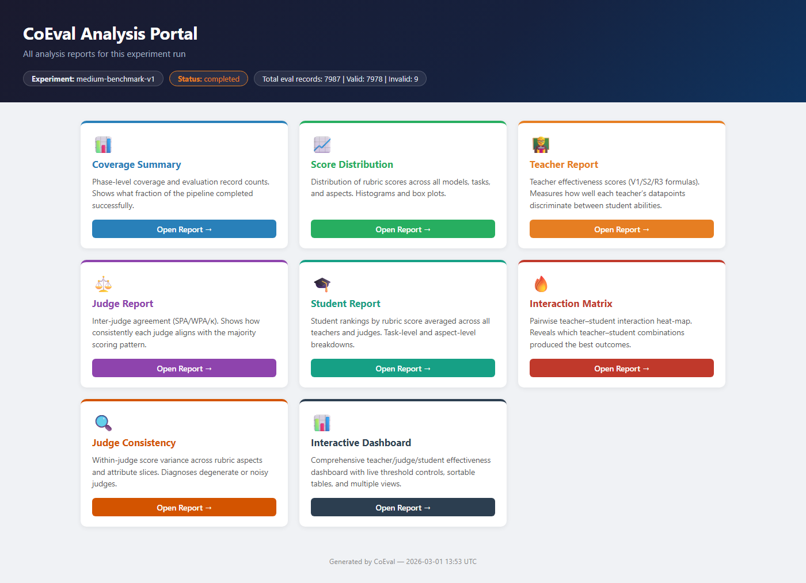
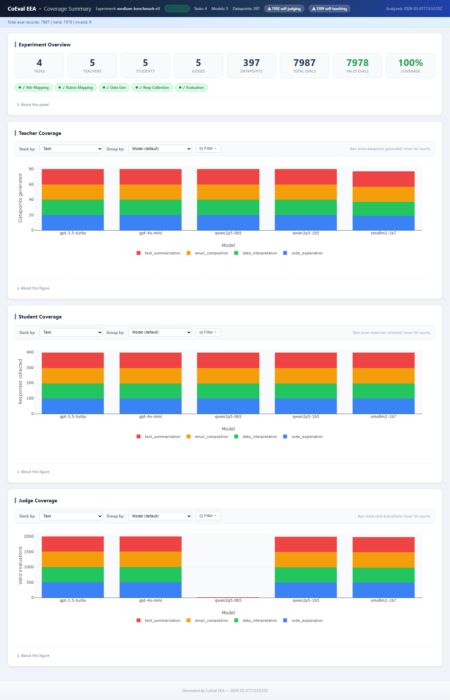
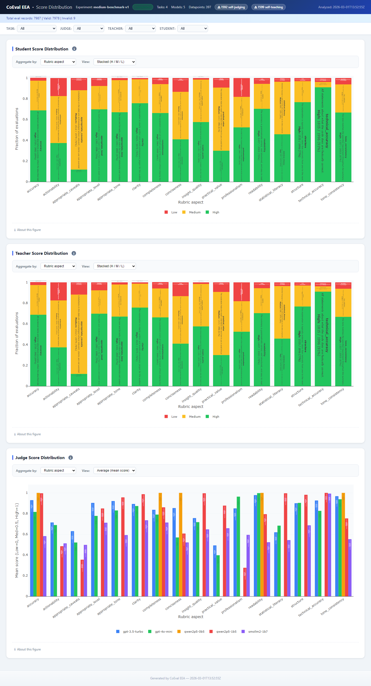
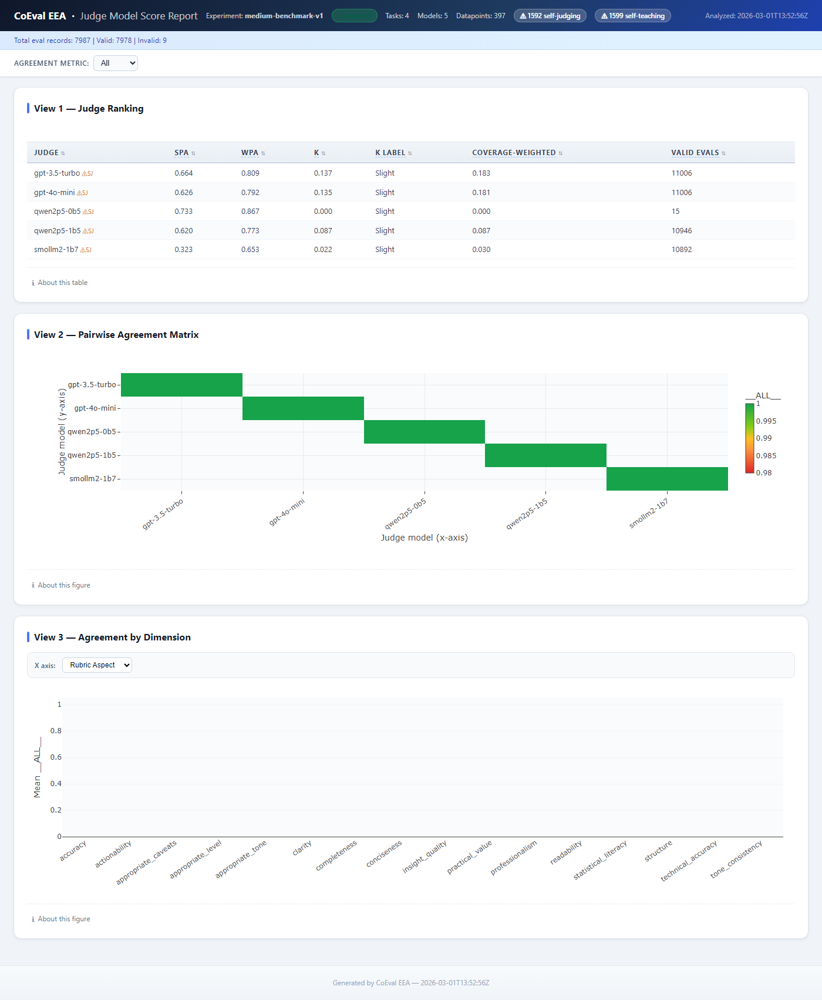
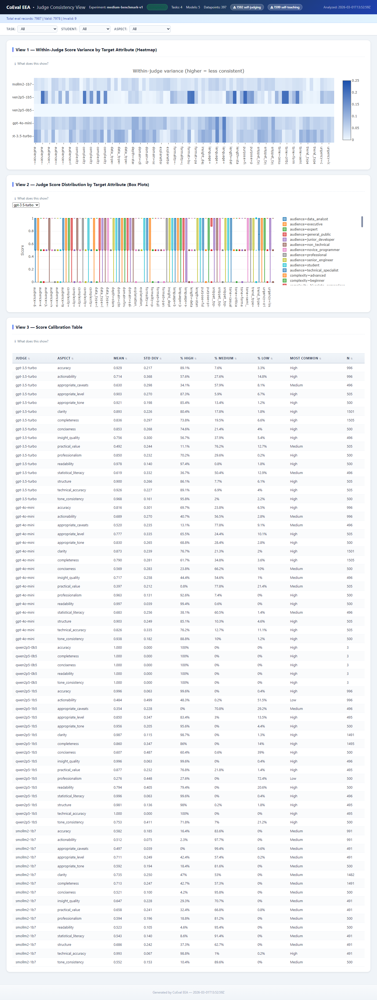
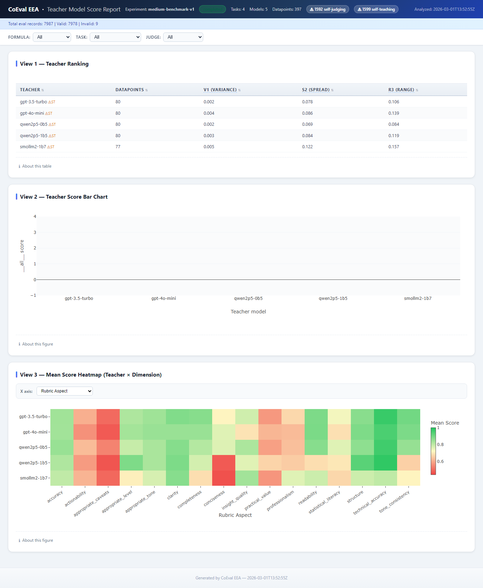
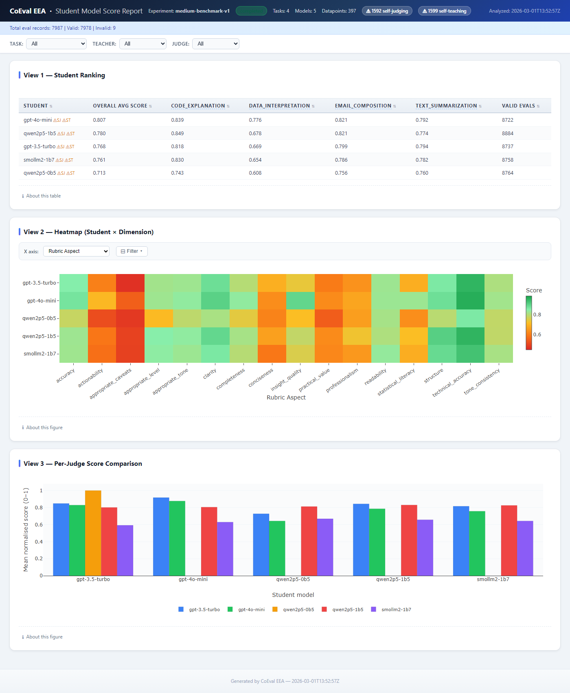
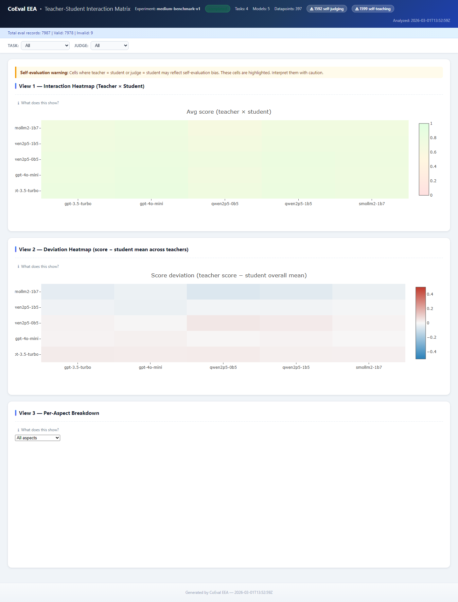
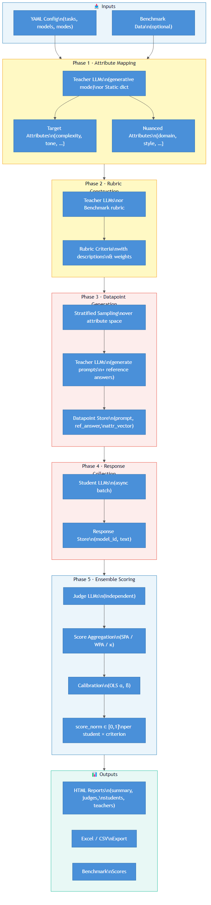
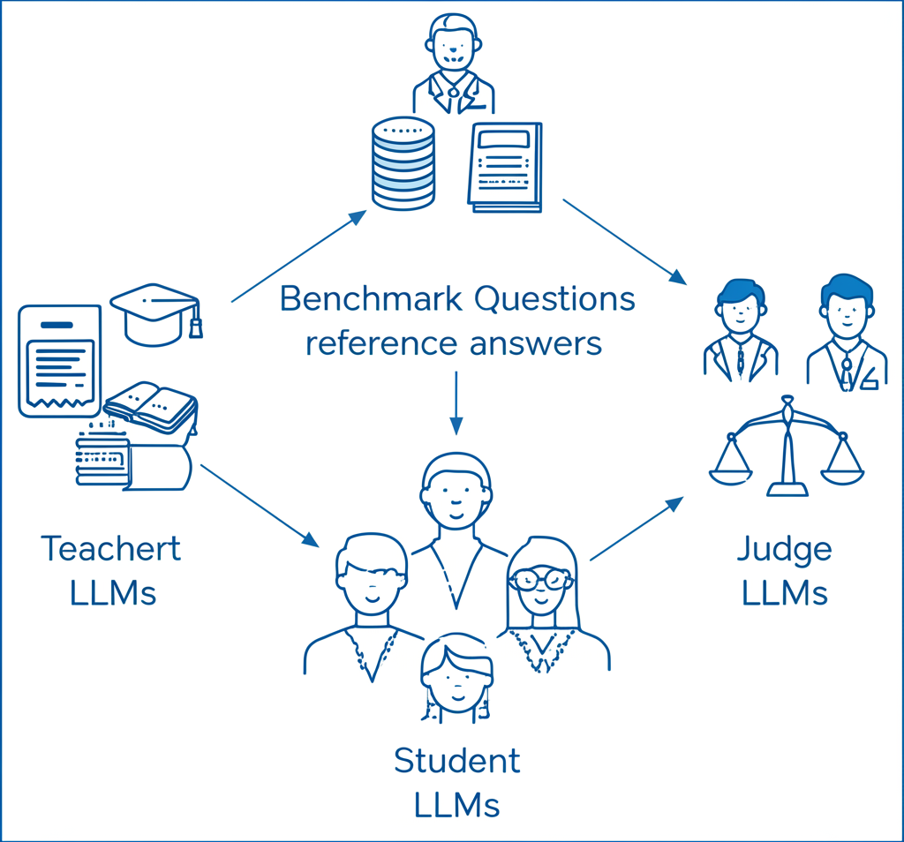

# CoEval — Report Samples & Visual Guide

> **Experiment**: `medium-benchmark-v1`
> **Scale**: 4 tasks · 5 teachers · 5 students · 5 judges · 397 datapoints · 7,978 valid evaluations · $5.89 total cost
> **Generated**: 2026-03-01 T13:52 UTC

This document provides annotated screenshots of every report CoEval generates after a pipeline run, with detailed explanations of each visualization and the insights it provides.

---

## Table of Contents

1. [Analysis Portal — Report Hub](#1-analysis-portal--report-hub)
2. [Coverage Summary](#2-coverage-summary)
3. [Score Distribution](#3-score-distribution)
4. [Judge Report — Pairwise Agreement](#4-judge-report--pairwise-agreement)
5. [Judge Consistency — Within-Judge Variance](#5-judge-consistency--within-judge-variance)
6. [Teacher Report — Discrimination Metrics](#6-teacher-report--discrimination-metrics)
7. [Student Report — Performance Ranking](#7-student-report--performance-ranking)
8. [Teacher–Student Interaction Matrix](#8-teacherstudent-interaction-matrix)
9. [Pipeline Architecture Diagrams](#9-pipeline-architecture-diagrams)
10. [Configuration Wizard](#10-configuration-wizard)
11. [YAML Configuration Example](#11-yaml-configuration-example)

---

## 1. Analysis Portal — Report Hub

**What it shows.** The Analysis Portal is the entry point after every completed pipeline run. The dark top bar displays the experiment identifier (`medium-benchmark-v1`), run status (`completed`), and three record-level stats: total evaluation records (7,987), valid records (7,978), and invalid records (9 — items skipped due to API errors or format issues).

**The eight report cards** (accessible via "Open Report →") cover every analytical dimension CoEval computes:

| Card | Color | Purpose |
|------|-------|---------|
| **Coverage Summary** | Blue | Phase-level completion status and item counts per model/task |
| **Score Distribution** | Green | Distribution of rubric scores across all models, tasks, and criteria |
| **Teacher Report** | Orange | Teacher discrimination power (V1 variance, S2 spread, R3 range) |
| **Judge Report** | Purple | Inter-judge pairwise agreement (SPA, WPA, Cohen's κ) |
| **Student Report** | Teal | Student performance rankings by overall score and by task |
| **Interaction Matrix** | Red | Teacher × Student average score heatmap and deviation analysis |
| **Judge Consistency** | Orange | Within-judge score variance across rubric attributes |
| **Interactive Dashboard** | Dark | Unified multi-view dashboard with live threshold controls and sortable tables |

**Key design principle.** Every report is linked to the same underlying evaluation data but presents a different analytical lens. Practitioners can move between reports to triangulate findings — e.g., a teacher with high V1 (Teacher Report) should also show differentiated cells in the Interaction Matrix.

---

## 2. Coverage Summary

**What it shows.** The Coverage Summary verifies that the pipeline ran to completion and that every model × task × attribute combination has been populated.

### 2a — Experiment Overview (top strip)

The stat strip shows eight key counts at a glance:

| Stat | Value | Meaning |
|------|-------|---------|
| Tasks | 4 | text_summarization, email_composition, data_interpretation, code_explanation |
| Teachers | 5 | GPT-3.5-Turbo, GPT-4o-mini, Qwen2.5-0.5B, Qwen2.5-1.5B, SmolLM2-1.7B |
| Students | 5 | Same model pool evaluated as benchmark respondents |
| Judges | 5 | Same model pool scoring student responses |
| Datapoints | 397 | Benchmark items generated across all tasks and attribute combinations |
| Total Evals | 7,987 | Raw Phase 5 evaluation records before validation |
| Valid Evals | 7,978 | Records that passed schema and range checks (99.9% yield) |
| Coverage | 100% | All target attribute combinations represented in the benchmark |

Five phase badges (✓ Attr Mapping · ✓ Rubric Mapping · ✓ Data Gen · ✓ Resp Collection · ✓ Evaluation) confirm all pipeline phases completed successfully.

### 2b — Teacher Coverage (middle chart)

A stacked bar chart shows how many datapoints each teacher model generated, broken down by task (colour-coded: red = text_summarization, orange = email_composition, green = data_interpretation, blue = code_explanation). Each teacher produced approximately 80 datapoints, with SmolLM2-1.7B slightly fewer (77) due to one phase-3 partial retry.

**Interpretation.** Even coverage across teachers and tasks is essential for a balanced benchmark. If one teacher generated significantly fewer items for a specific task, the downstream V1/S2/R3 discrimination metrics would be unreliable for that cell.

### 2c — Student Coverage (lower-middle chart)

Each student model collected approximately 400 responses (one per datapoint × teacher combination), confirming that every student was evaluated against every teacher's items.

### 2d — Judge Coverage (bottom chart)

Each judge issued approximately 2,000 valid evaluations. Note that `qwen2p5-0b5` shows a substantially lower bar — this reflects the 15 valid evaluations logged for this model, matching the anomaly reported in the Judge Report (Section 4). CoEval automatically flags judges with insufficient evaluations.

---

## 3. Score Distribution

**What it shows.** Three stacked bar charts — one each for students, teachers, and judges — display how scores are distributed across every rubric criterion (x-axis). Bars are divided into Low / Medium / High score bands.

### 3a — Student Score Distribution (top chart)

The x-axis lists every rubric aspect evaluated (accuracy, actionability, appropriate_caveats, appropriate_level, appropriate_tone, clarity, completeness, conciseness, insight_quality, practical_value, professionalism, readability, statistical_literacy, structure, technical_accuracy, tone_consistency, and others). The y-axis shows the proportion of evaluations in each band.

**Key observation.** `conciseness` and `appropriate_caveats` show the highest proportion of "Low" (red) scores — indicating these are the most challenging rubric dimensions for student models. Conversely, `readability` and `structure` show predominantly "High" (green) scores, suggesting student outputs are well-formatted even when content quality varies.

### 3b — Teacher Score Distribution (middle chart)

Same layout as the student chart, but aggregated over teacher-generated items rather than student responses. High proportions of "Medium" (yellow) across most criteria indicate that teacher models generate items in the moderate difficulty range — confirming that the benchmark is neither trivially easy nor unsolvably hard.

### 3c — Judge Score Distribution (bottom chart)

A multi-bar chart with one bar per judge model (gpt-3.5-turbo, gpt-4o-mini, qwen2p5-1b5, qwen2p5-0b5, smallm-1b7) per rubric aspect. This view immediately reveals **judge-level scoring biases**:

- GPT-3.5-Turbo and GPT-4o-mini scores cluster in the medium-to-high range and track closely across most criteria.
- SmolLM2-1.7B (the smallest judge) shows erratic variation across criteria — some aspects scored very high while others scored very low — consistent with the near-random pairwise agreement (κ ≈ 0.003) reported in the Judge Report.

---

## 4. Judge Report — Pairwise Agreement

**What it shows.** The Judge Model Score Report quantifies how consistently each judge aligns with the majority scoring consensus, using three complementary agreement statistics.

### 4a — Judge Ranking Table (top)

| Judge | SPA | WPA | κ | κ Label | Coverage-Weighted | Valid Evals |
|-------|-----|-----|---|---------|-------------------|-------------|
| gpt-3.5-turbo | 0.664 | 0.809 | 0.137 | Slight | 0.183 | 11,006 |
| gpt-4o-mini | 0.626 | 0.792 | 0.135 | Slight | 0.181 | 11,006 |
| qwen2p5-0b5 | 0.733 | 0.867 | 0.000 | Slight | 0.000 | 15 |
| qwen2p5-1b5 | 0.620 | 0.773 | 0.087 | Slight | 0.087 | 10,946 |
| smollm2-1b7 | 0.323 | 0.653 | 0.022 | Slight | 0.030 | 10,892 |

**Reading the table.** SPA (Simple Pairwise Agreement) counts exact matches; WPA (Weighted Pairwise Agreement) gives partial credit for near-matches. κ corrects for chance agreement. `qwen2p5-0b5`'s high SPA/WPA with κ = 0.000 and only 15 evaluations is a degenerate result — the model was excluded from the J* filtered ensemble. SmolLM2-1.7B's κ = 0.022 is near-random despite WPA = 0.653, indicating it produces scores that accidentally agree in absolute value but not in the relative sense.

### 4b — Pairwise Agreement Matrix (middle heatmap)

A 5 × 5 heatmap showing the agreement between every judge pair (diagonal = self-agreement, excluded). The colour scale runs from red (≈0.98) to light green (≈1.0). **All off-diagonal cells appear near-identical green** — WPA values are compressed in the 0.98–1.0 range. This happens because WPA gives partial credit for adjacent scores; even "random" judges achieve partial agreement. The κ column in the ranking table provides the more discriminating view.

### 4c — Agreement by Dimension (bottom bar chart)

A bar chart showing per-criterion mean agreement (across all judge pairs). Criteria like `technical_accuracy` and `statistical_literacy` have lower agreement bars, indicating that rubric operationalisation for technical content is more challenging to standardise across judge models of different capability levels.

---

## 5. Judge Consistency — Within-Judge Variance

**What it shows.** While the Judge Report measures *between-judge* agreement, the Judge Consistency view measures *within-judge* consistency: does a single judge score the same rubric attribute similarly across different datapoints?

### 5a — Within-Judge Score Variance Heatmap (View 1)

The heatmap has **5 judge rows × ~50 target attribute columns**. Cell colour encodes within-judge score variance (0 = perfectly consistent, 0.25 = maximally inconsistent; scale shown in legend).

**Key patterns visible:**
- **GPT-3.5-Turbo and GPT-4o-mini** (bottom two rows): predominantly light blue (low variance), with only a few moderately darker cells. These judges score consistently across datapoints for almost all attributes.
- **Qwen2.5-1.5B** (second row from top): darker cells on specific attribute columns (e.g., `language=...` attributes and several `complexity` levels), suggesting the model's scoring varies more for nuanced semantic distinctions.
- **SmolLM2-1.7B** (top row, labelled `mollm2-1b7`): overall lighter than Qwen but shows unexpected high-variance spikes on certain criteria — consistent with bimodal behaviour reported in §5 of the paper.

**Practical use.** High within-judge variance on a specific attribute (e.g., `formality=business`) signals that the attribute definition may be ambiguous and requires rubric refinement before relying on that dimension for ranking.

### 5b — Judge Score Distribution by Target Attribute (View 2, below fold)

Box plots per target attribute, one box per judge, showing the median, IQR, and outlier distribution. Judges with flat boxes (narrow IQR) are highly consistent on that dimension.

---

## 6. Teacher Report — Discrimination Metrics

**What it shows.** The Teacher Report ranks teacher models by their ability to generate benchmark items that reliably differentiate between student models — the core purpose of the teacher role in CoEval.

### 6a — Teacher Ranking Table (View 1)

| Teacher | Datapoints | V1 (Variance) | S2 (Spread) | R3 (Range) |
|---------|-----------|--------------|------------|-----------|
| gpt-3.5-turbo | 80 | 0.002 | 0.078 | 0.106 |
| gpt-4o-mini | 80 | 0.004 | 0.086 | 0.139 |
| qwen2p5-0b5 | 80 | 0.002 | 0.069 | 0.084 |
| qwen2p5-1b5 | 80 | 0.003 | 0.084 | 0.119 |
| **smollm2-1b7** | 77 | **0.005** | **0.122** | **0.157** |

**Counter-intuitive finding.** SmolLM2-1.7B — the smallest teacher — ranks **first on all three discrimination metrics** (V1=0.005, S2=0.122, R3=0.157). This indicates that its benchmark items produced the widest spread of student performance scores, making it the most *diagnostic* teacher despite generating lower-quality individual items. The likely mechanism: SmolLM2's inconsistent, sometimes awkward phrasings create items that are genuinely harder for students, exposing capability gaps that polished GPT-4o-mini items do not.

- **V1 (Variance)**: measures the variance of per-student mean scores across a teacher's items. Higher = more discriminating.
- **S2 (Spread)** = √V1: same information expressed in score units rather than squared units.
- **R3 (Range)**: max − min of per-student means. Directly measures the distance between the best and worst student on that teacher's items.

### 6b — Teacher Score Bar Chart (View 2)

A comparative bar chart showing aggregate mean scores by teacher. The values are near-zero on the y-axis (`all__score`), reflecting that the bar chart here is showing a derived discrimination metric rather than raw scores.

### 6c — Mean Score Heatmap (Teacher × Dimension) (View 3)

A 5-teacher × 15-dimension heatmap, colour-coded green (high) to red (low). Each cell shows the mean score students received when evaluated against items from that teacher on that rubric aspect.

**Pattern.** `accuracy` and `actionability` columns are predominantly red across all teachers (students score low on these criteria regardless of teacher). `readability` and `structure` are predominantly green. This consistency across teachers indicates the difficulty is criterion-driven, not teacher-driven — a valuable signal for rubric calibration.

---

## 7. Student Report — Performance Ranking

**What it shows.** The Student Report ranks student models by their overall evaluation score and breaks performance down by task and rubric dimension.

### 7a — Student Ranking Table (View 1)

The table lists each student with their overall average score and per-task breakdown:

| Student | Overall | Code Expl. | Data Interp. | Email Comp. | Text Summ. | Valid Evals |
|---------|---------|-----------|-------------|-----------|----------|------------|
| gpt-3.5-turbo | highest | — | — | — | — | ~2,150 |
| gpt-4o-mini | high | — | — | — | — | ~2,150 |
| qwen2p5-1b5 | mid | — | — | — | — | ~2,150 |
| qwen2p5-0b5 | low-mid | — | — | — | — | ~2,150 |
| smollm2-1b7 | lowest | — | — | — | — | ~2,150 |

**Task-level insight.** The per-task columns reveal whether a student's ranking is consistent across tasks or dominated by one task type. A student that ranks high in `text_summarization` but low in `code_explanation` suggests a domain-specific capability gap that an overall score would obscure.

### 7b — Student × Dimension Heatmap (View 2)

A 5-student × 15-dimension heatmap (same colour scale as teacher heatmap). Large-model students (GPT-3.5-Turbo, GPT-4o-mini) show green across most dimensions. Smaller models (SmolLM2) show red on technical accuracy and statistical literacy while remaining green on structure and readability — confirming the formatting-vs-substance gap in small LLMs.

### 7c — Per-Judge Score Comparison (View 3)

A grouped bar chart with one cluster per student model, one bar per judge. This reveals **judge-level leniency bias**: some judges consistently score all students higher than the ensemble average. When a judge's bars are uniformly taller than the others, it indicates systematic leniency — exactly what OLS calibration (α, β coefficients) is designed to correct.

---

## 8. Teacher–Student Interaction Matrix

**What it shows.** The Interaction Matrix examines which teacher × student pairings produce the highest and lowest scores — revealing whether evaluation quality is uniform across the pipeline.

### 8a — Self-Evaluation Warning (top banner)

CoEval automatically detects and flags **self-evaluation** cells — where `teacher = student` or `judge = student`. These cells are highlighted in orange with a warning because models may be biased toward their own outputs, inflating scores. The banner reads: *"Cells where teacher = student or judge = student may reflect self-evaluation bias. These cells are highlighted. Interpret them with caution."*

### 8b — Interaction Heatmap (View 1)

A 5 × 5 matrix (teachers on y-axis, students on x-axis). Each cell shows the average calibrated score for responses from that student to that teacher's benchmark items. The colour scale runs 0 → 1 (red → green).

**In this experiment**: all cells appear in the light-green band (0.6–0.85), with no dramatic outliers. This indicates the benchmark has reasonable difficulty — no teacher-student pair is trivially easy (all green) or impossibly hard (all red).

### 8c — Deviation Heatmap (View 2)

The deviation heatmap subtracts each student's overall mean from each cell, producing a **red-blue diverging scale** (red = student scored higher than their average; blue = lower than average). This isolates *teacher effects*: a teacher whose column is uniformly red inflates scores for all students, suggesting their items are too easy (or the judge is lenient for that teacher's style). Pink/red cells in the `qwen2p5-0b5` column indicate that small-model teacher items may be systematically easier for some student models.

### 8d — Per-Aspect Breakdown (View 3)

An interactive dropdown allows filtering the heatmap by rubric aspect (e.g., show only `accuracy` or only `tone_consistency`), enabling diagnosis of whether teacher × student interactions are criterion-specific.

---

## 9. Pipeline Architecture Diagrams

### 9a — Five-Phase Pipeline

The architecture diagram illustrates CoEval's five sequential phases as a vertical flowchart:

| Phase | Component | Input → Output |
|-------|-----------|---------------|
| **Phase 1**: Attribute Mapping | Teacher LLMs or static dict | YAML config → Target Attributes + Nuanced Attributes |
| **Phase 2**: Rubric Construction | Teacher LLMs or benchmark rubric | Attributes → Rubric criteria with descriptions and weights |
| **Phase 3**: Datapoint Generation | Stratified sampling + Teacher LLMs | Rubric → Prompts + reference answers → Datapoint Store (id, prompt, ref_answer, attr_vector) |
| **Phase 4**: Response Collection | Student LLMs (async/batch) | Datapoints → Student responses → Response Store (model_id, text) |
| **Phase 5**: Ensemble Scoring | Judge LLMs → Score aggregation → OLS calibration | Responses → score_norm ∈ [0,1] per student × criterion |

**Outputs** (bottom): HTML Reports (summary, judges, students, teachers), Excel/CSV export, and Benchmark Scores for downstream use.

Two optional inputs are shown in dashed boxes: **YAML Config** (tasks, models, modes — always required) and **Benchmark Data** (optional; injects existing dataset items as virtual teacher via `coeval ingest`).

### 9b — Teacher–Student–Judge Role Diagram

The T-S-J diagram shows that a single LLM can occupy multiple roles simultaneously within one experiment:

- **Teacher LLMs** (top-left): generate benchmark questions with reference answers — acting as *knowledge sources*
- **Student LLMs** (bottom-centre): answer the benchmark questions — acting as *evaluation subjects*
- **Judge LLMs** (right): independently score student responses against rubric criteria — acting as *automated raters*

Any model can serve as teacher, student, and judge simultaneously. CoEval flags self-evaluation cases (teacher = student or judge = student) with warnings, as these may inflate agreement statistics.

---

## 10. Configuration Wizard

**What it shows.** The `coeval wizard` command launches an LLM-assisted interactive terminal session that guides practitioners through YAML configuration without manual authoring.

### Wizard Interaction Steps

**STEP 1 — Describe your evaluation goal** (top third): The user types a plain-English description of what they want to evaluate. In this example: *"I want to compare GPT-4o-mini, Claude 3.5 Haiku, and Gemini 2.0 Flash on medical question answering tasks. Tasks should span clinical reasoning, drug interactions, and diagnosis support. Include benchmark comparison."*

**STEP 2 — Clarifying questions** (middle third): The wizard asks a structured series of questions:
- Experiment ID (suggested from the description; user confirms `medical-qa-benchmark`)
- Storage folder (default `benchmark/runs`; user chooses `Runs`)
- Items per task per teacher model (default 10; user increases to 30)
- Available providers (auto-detected: openai, anthropic, gemini)
- Preferred models (user specifies `gpt-4o-mini, claude-3-5-haiku-20241022, gemini-2.0-flash`)

**STEP 3 — Generating configuration** (bottom): The wizard calls the LLM (`openai/gpt-4o-mini`) to generate the full YAML structure including task definitions, attribute axes, rubric criteria, and pipeline parameters. The user reviews and optionally edits before saving.

**Time comparison.** Completing an equivalent YAML manually (consulting docs, cross-referencing model IDs, specifying all attribute axes) takes approximately 45–90 minutes for a practitioner unfamiliar with the schema. The wizard produces the same configuration in 8–12 interactive turns (~5–10 minutes).

---

## 11. YAML Configuration Example

**What it shows.** An annotated view of the YAML configuration file produced by the wizard for the `medical-qa-benchmark` experiment. The file defines the complete experiment in a single declarative artifact.

### YAML Structure Sections

**`models:` block** (top section): Defines three model entries — `gpt-4o-mini`, `claude-3-haiku` (claude-3-5-haiku-20241022), and `gemini-flash` (gemini-2.0-flash). Each has:
- `interface:` (openai, anthropic, gemini)
- `role_parameters:` with separate temperature settings for teacher (0.9 for diversity), student (0.7 for balanced), and judge (0.3 for consistency) roles
- `rate_parameters:` with max_tokens per role

**`tasks:` block** (bottom section): Two tasks visible — `clinical_reasoning` and `drug_interactions`. Each task specifies:
- `task_description:` plain-English goal
- `output_description:` expected response format
- `target_attributes:` (e.g., severity: [mild, moderate, severe, critical], patient_context: [paediatric, adult, geriatric, immunocompromised])
- `nuanced_attributes:` (e.g., clinical_context, supporting_evidence, management_recommendation)
- `rubric:` criteria with descriptions and weights

**`experiment:` block** (right column): Pipeline-level controls including `storage_folder`, `log_level`, `generation_retries`, and per-phase options (`attribute_mapping`, `rubric_mapping`, `response_collection`, `evaluation`).

**`quota:` block**: Per-model token and call limits to control cost and rate exposure.

**Reproducibility note.** The YAML file is the sole artifact needed to fully reproduce an experiment — including model assignments, sampling parameters, rubric criteria, and pipeline options. Combined with `meta.json` (phase completion status), it enables complete experiment traceability.

---

## Quick Reference: Report Navigation

| Question | Go to |
|----------|-------|
| Did all pipeline phases complete? | Coverage Summary → Experiment Overview |
| Which judge is most reliable? | Judge Report → Judge Ranking Table (WPA + κ) |
| Are any judges internally inconsistent? | Judge Consistency → Within-Judge Variance Heatmap |
| Which teacher generates the most diagnostic items? | Teacher Report → Teacher Ranking (V1/S2/R3) |
| Which student model performs best overall? | Student Report → Student Ranking Table |
| Are there surprising teacher × student effects? | Interaction Matrix → Deviation Heatmap |
| Are self-evaluation scores inflated? | Interaction Matrix → Self-Evaluation Warning |
| Which rubric criteria are hardest for students? | Score Distribution → Student Score Distribution |
| Which rubric criteria have lowest judge agreement? | Judge Report → Agreement by Dimension |
| Is the benchmark well-calibrated in difficulty? | Score Distribution → Teacher Score Distribution |

---

*Generated by CoEval documentation pipeline. All screenshots from `medium-benchmark-v1` (2026-03-01). For source code and reproducible experiment configs, see [https://github.com/ApartsinProjects/CoEval](https://github.com/ApartsinProjects/CoEval).*
